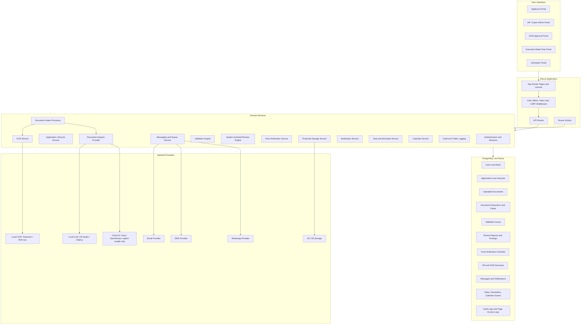
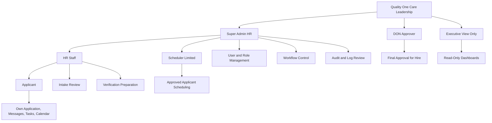
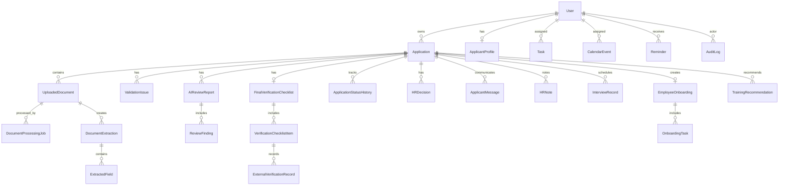
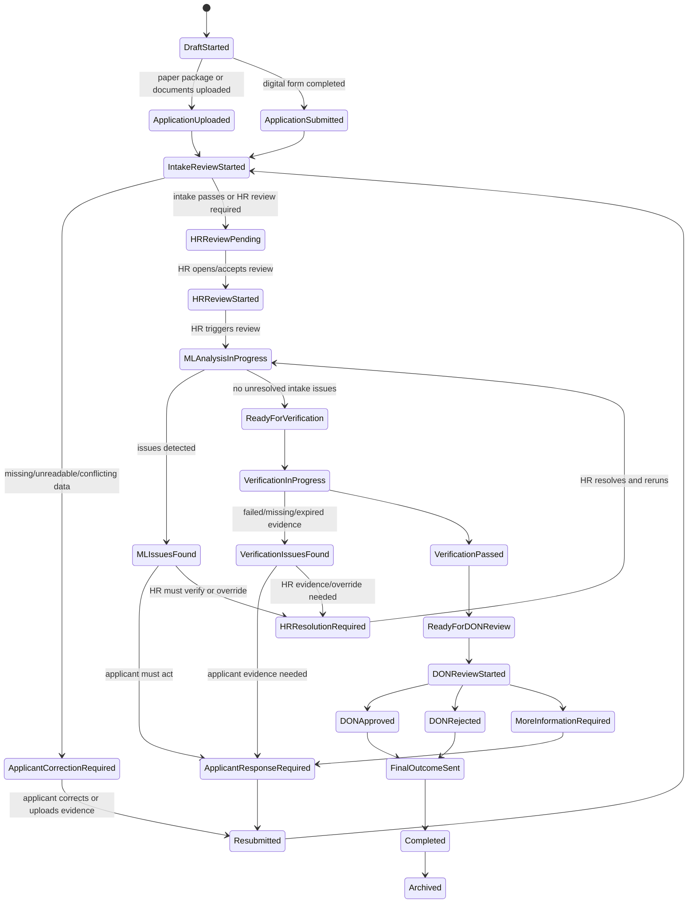

# Quality One Care HR Operations Portal

## Architecture and Workflow Handoff

This document describes the intended production architecture and workflow for the Quality One Care HR Operations Portal. It is written as a rebuild handoff for another engineer or AI coding agent.

Company: Quality One Care Home Health Inc.

Business domain: Healthcare HR intake, nursing/care applicant review, pediatric-care compliance, credential verification, DON final approval, onboarding, notifications, calendar, tasks, and audit logging.

Core principle: the portal must not guess applicant or credential facts. Machine-learning-assisted extraction may suggest values, but uncertain values must be flagged for applicant or HR review.

---

## 1. Product Goal

The portal should operate as a healthcare HR command center, not a simple form app.

It must support:

- Applicant account creation and authenticated application start.
- Digital application entry.
- Paper/scanned application package upload.
- Resume and supporting-document upload.
- OCR and machine-learning-assisted intake review.
- Applicant correction workflow.
- HR review queue.
- Compliance verification checklist.
- External/manual verification evidence tracking.
- DON final approval.
- Onboarding readiness.
- Calendar, tasks, reminders, messages, notifications, and audit logs.
- Clear role separation between Applicant, HR, Super Admin HR, DON, CEO, and Scheduler.

---

## 2. High-Level System Architecture

---

## 3. Role Organigram

Role rules:

- Applicant: own records only. No HR, DON, Admin, audit, or verification pages.
- HR: review submitted applications, manage verification preparation, message applicants, complete HR tasks.
- Super Admin HR: full operational control, user management, workflow management, audit/log review.
- DON Approver: final approval authority. Can approve, reject, or return for correction. Should not manage users.
- Executive View Only: dashboards and progress only, no edits.
- Scheduler Limited: approved applicants only, no rejected/draft/verification records.

---

## 4. Core Data Architecture

Important source-of-truth rule:

All dashboards, queues, applicant progress cards, admin counts, and workflow buttons must read from the same application lifecycle/status fields and status history. There must be no separate applicant-only status logic.

---

## 5. Application Lifecycle Status Model

The enforced statuses should be:

1. Draft Started
2. Application Uploaded
3. Application Submitted
4. Intake Review Started
5. Applicant Correction Required
6. Resubmitted
7. HR Review Pending
8. HR Review Started
9. Machine-Learning Analysis In Progress
10. Machine-Learning Issues Found
11. Applicant Response Required
12. HR Resolution Required
13. Ready for Verification
14. Verification in Progress
15. Verification Issues Found
16. Verification Passed
17. Ready for DON Review
18. DON Review Started
19. DON Approved
20. DON Rejected
21. More Information Required
22. Final Outcome Sent
23. Completed
24. Archived

---

## 6. Exact Intended Workflow

### Step 1: Authentication and Account Creation

The application is not public. Every user must log in.

Applicant account creation requires:

- First name.
- Last name.
- Email.
- Password.
- Phone.
- Required identity photo.
- Consent for internal identity verification and employment processing.

Account is not created until photo is provided.

### Step 2: Applicant Starts Application

After login, applicant chooses one path:

- Start a new web-based application.
- Upload completed application package.

The system creates an application record immediately:

- `application_created_at`.
- `created_by`.
- `applicant_id`.
- `intake_type`: `digital`, `paper`, or `document-intake`.
- `current_status`: `draft`.

Upload must never exist without an application ID.

### Step 3: Document Intake

All uploads feed the same Document Intake Engine.

Accepted document types include:

- Completed scanned application.
- Resume.
- Nursing license.
- CPR certificate.
- Training certificate.
- Government ID or work authorization.
- Annual physical.
- TB test or chest X-ray.
- NSO liability insurance.
- CGIS/background check receipt.
- References.
- Other supporting documents.

The intake engine must:

- Store files in protected storage.
- Link every document to `application_id`.
- Classify the document type.
- Run OCR where possible.
- Extract fields only when confidence is high.
- Flag uncertain fields for review.
- Never hallucinate missing facts.

### Step 4: Machine-Learning-Assisted Intake Review

The system checks:

- Required fields.
- Missing documents.
- Unreadable scans.
- Name, DOB, address, date, license, and employment conflicts.
- Missing signatures.
- Expired credentials.
- Unsupported pediatric care claims.

If issues exist:

- Status becomes `Applicant Correction Required`, `Machine-Learning Issues Found`, or `HR Resolution Required` depending on who must act.
- Applicant receives message/task if applicant action is required.
- HR/Super Admin receives queue task if HR review is required.

### Step 5: Applicant Correction Loop

Applicant can:

- Upload missing documents.
- Upload missing page.
- Correct specific field.
- Mark field as included in scanned application with note.
- Submit explanation.

After correction:

- Status becomes `Resubmitted`.
- Intake review runs again.

### Step 6: HR Review

When intake is sufficiently complete or requires human screening:

- Status becomes `HR Review Pending`.
- HR review queue item is created.
- HR task is created.
- Admin/HR notification is created.
- Audit log is written.

HR opening the case changes status to `HR Review Started`.

HR can:

- Review application data.
- Review documents.
- Review extracted fields.
- Review unresolved issues.
- Request missing documents.
- Send messages.
- Add HR notes.
- Override with required justification.
- Rerun machine-learning-assisted review.
- Pass to verification.
- Reject at HR screening.
- Put on hold.
- Archive.

### Step 7: Mandatory Nursing Verification Logic

For nursing and pediatric care applicants, the system must enforce:

- At least 1 year clinical experience involving pediatric patients within past 2 years.
- At least 2 professional employment verifications.
- At least 1 character reference, preferably supervisor level or higher.
- CGIS/background check receipt.
- OIG exclusion list check.
- Maryland Case Search check.
- Nursys verification for RN/LPN applicants.
- Maryland Board of Nursing license current and active for RN/LPN applicants.
- Annual physical health form.
- TB test or chest X-ray.
- NSO or equivalent liability insurance where applicable.
- Current CPR.
- Current government ID or work authorization.
- Sanitation training where required.

External checks are manual/provider-ready. The app must not store external site passwords or scrape secured websites.

### Step 8: Final Verification

When HR passes the case to verification:

- Final verification checklist is created if it does not exist.
- Status becomes `Verification in Progress`.
- Each checklist item is editable by HR/Admin.
- Evidence documents can be attached.
- HR can mark items verified, failed, expired, not applicable, or needs follow-up.

DON submission is blocked when critical required items are missing, expired, failed, or not reviewed.

### Step 9: DON Final Approval

When verification passes:

- Status becomes `Ready for DON Review`.
- DON queue item is created.
- DON is notified.

DON reviews:

- Full application.
- Uploaded documents.
- Machine-learning-assisted report.
- HR notes.
- Verification checklist.
- Evidence.
- Applicant correction history.
- Audit trail.

DON actions:

- Approved for Hire.
- Not Approved.
- Returned for Correction / More Information Required.

The system must state:

> Machine-learning-assisted review. Final approval must be completed by the authorized DON reviewer.

### Step 10: Final Outcome and Record Storage

After DON decision:

- Outcome is communicated by in-app message, email, and SMS if enabled.
- If providers are missing, messages queue and clearly show provider not configured.
- Full record is retained:
  - Application.
  - Resume.
  - Credentials.
  - OCR/extraction result.
  - Review report.
  - HR notes.
  - Verification logs.
  - DON decision.
  - Communication history.
  - Audit trail.

### Step 11: Printable Compliance Package

Super Admin/authorized users can print:

- Full application.
- Resume.
- Credentials.
- Machine-learning-assisted review.
- Verification checklist.
- HR notes.
- Correction history.
- DON decision.
- Final communication record.

---

## 7. Dashboard and Queue Requirements

### Super Admin Dashboard

Must show actionable operational information:

- Pending HR Reviews.
- HR Review Started.
- Machine-Learning Issues Found.
- Applicant Corrections Required.
- Applications Awaiting Verification.
- Verification in Progress.
- Ready for DON Review.
- DON Approval Queue.
- Missing Documents Requested.
- Expiring Licenses.
- Failed/Queued Messages.
- Overdue Tasks.
- Recent Applicant Submissions.
- System Health Alerts.

Every card must open the correct admin route.

### Applicant Dashboard

Applicant sees simplified progress only:

- Draft started.
- Application submitted.
- Waiting for HR review.
- HR review started.
- Correction requested.
- Verification in progress.
- Ready for DON review.
- DON approved or rejected.
- Onboarding started.

Applicant must not see internal notes, audit logs, or HR-only findings.

---

## 8. Required Security Controls

- All protected routes require authentication.
- Role-based route protection is mandatory.
- Uploaded files must not be publicly accessible.
- Signed/authorized document access only.
- Audit all major events.
- Rate limit login, registration, password recovery, and upload.
- Store password hashes only.
- Store recovery tokens hashed and expiring.
- Do not use photo for facial recognition.
- Do not send documents to cloud AI unless explicitly enabled.
- Prefer local OCR/local LLM for sensitive documents.

---

## 9. Notification, Task, Calendar, and Message Rules

Every workflow movement must create:

- Status history record.
- Audit log.
- Queue/task record where operational work is needed.
- Notification for the responsible staff/applicant.
- Message when applicant action is required.

The notification center must never be blank. If no active notifications exist, it must show:

> No active notifications at this time.

---

## 10. DON Assessment Output Categories

Final operational assessment should map to:

A. Applicant can be scheduled for onboarding.

- DON approved.
- Required checklist verified or properly marked not applicable.
- No critical compliance blockers.

B. Applicant does not meet requirement.

- DON rejected or HR screening rejection.
- Clear reason recorded.
- No automated rejection without human decision.

C. Applicant needs further information.

- Missing, expired, unclear, or conflicting evidence exists.
- Applicant/HR/DON must resolve before approval.

